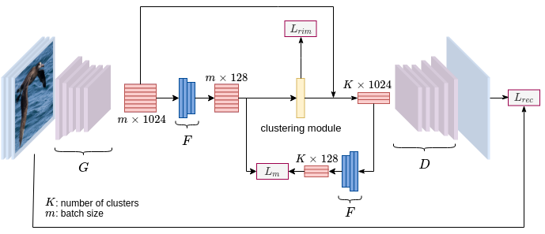

# BMVC20 - Deep Metric Learning Meets DeepClustering: An Novel Unsupervised Approach for Feature Embedding
AIOZ - BMVC 2020: "Deep Metric Learning Meets DeepClustering: An Novel UnsupervisedApproach for Feature Embedding"

This repository is the implementation of `CBSwR` for Unsupervised Deep Metric Learning task. Our model achieved **55.9**, **37.6** on NMI, and **47.5**, **45.6** on R@1 over CUB200-2001 and Car196 datasets, respectively. For the detail, please refer to [link](http://arxiv.xxx).

### Summary

* [The proposed framework](#the-proposed-framework)
* [Prerequisites](#prerequisites)
* [Preprocessing](#preprocessing)
* [Training](#training)
* [Testing](#testing)
* [Citation](#citation)
* [License](#license)
* [More information](#more-information)

### The proposed framework 



### Prerequisites

Python3

Please install dependence package by run following command:
```
pip install -r requirements.txt
```

### Preprocessing

**CUB200-2011**

The CUB200-2011 dataset should be downloaded via [link](http://www.vision.caltech.edu/visipedia-data/CUB-200-2011/CUB_200_2011.tgz). The downloaded file should be extracted to `data/cub200` directory.

To pre-process CUB200-2011 dataset, please follow:

```
$ python pre_process/pre_process_cub200.py
```

**Car196**

The Car196 dataset should be downloaded via [img_link](http://imagenet.stanford.edu/internal/car196/car_ims.tgz) and [ano_link](http://imagenet.stanford.edu/internal/car196/cars_annos.mat). The downloaded files should be extracted to `data/car196` directory.

To pre-process Car196 dataset, please follow:

```
$ python pre_process/pre_process_car196.py
```

### Training
To train CBSwR model on **CUB200-2011** dataset, please follow:
```
$ python train.py --dataset cub200 --model_name CBSwR_CUB200
```
To train CBSwR model on **Car196** dataset, please follow:
```
$ python train.py --dataset car196 --model_name CBSwR_Car196
```
The training scores will be printed every epoch.


### Testing
In this repo, we include the pre-trained weight of CBSwR_CUB200 and CBSwR_Car196 models.

For `CBSwR_CUB200` pretrained model. Please download the [link](https://drive.google.com/file/d/1PsBSICUabh7NLNXoDZMvxj_6oGu_m7KO/view?usp=sharing) and move to `new_checkpoint`. The trained `CBSwR_CUB200` model can be tested in CUB200 validation set via: 
```
$ python test.py --dataset cub200 --checkpoint_path new_checkpoint/CBSwR_CUB200.pth
```
For `CBSwR_Car196` pretrained model. Please download the [link](https://drive.google.com/file/d/1n2S0qyjderr2jbcJSEi-zqAu4rqkEw7X/view?usp=sharing) and move to `new_checkpoint`. The trained `CBSwR_Car196` model can be tested in Car196 validation set via:
```
$ python test.py --dataset car196 --checkpoint_path new_checkpoint/CBSwR_Car196.pth
```


### Citation

If you use this code as part of any published research, we'd really appreciate it if you could cite the following paper:

```
Updating
```

### License

MIT License

### More information

AIOZ AI Homepage: https://ai.aioz.io